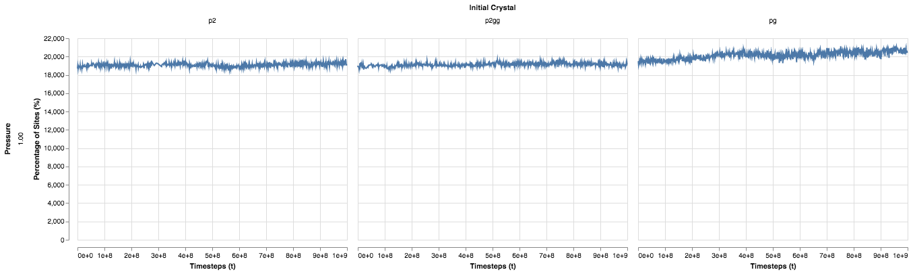

Melting Rate
============

The calculation of the melting rate is turning out to be more difficult than I would have thought, which is probably due to a number of different factors.

My first attempt at calculating the melting rate used the fraction of particles that were in the liquid phase, calculating the quantity $\tau_{M1}$

$$
\tau_{M1} = -\frac{\Delta \frac{N_\text{liq}}{N_\text{total}}} {\Delta t}
$$

This version of $\tau_M$ works for comparison between the simulations I am running, however, is  unsuitable for comparison between different simulations since it depends on the size of the simulation.

With the first attempt being somewhat of a stand in quantity to get qualitative results, I needed a quantity which could be compared to other simulations. Part of being able to compare to other simulations is that the value is invariant of the setup of the simulation. In this case I need a melting rate that is a measure of the distance the liquid--crystal interface moves. I have simulations in which the surface area is changing over the course of the simulation, so rather than performing a single normalisation by the surface area, divided all values by the surface area to give

$$
\tau_{M2} = -\frac{\Delta \frac{A}{P}}{\Delta t}
$$

where $A$ is the area of the crystal region and $P$ is the perimeter. Note that in all instances of the code I refer to the 3D names *volume* and *surface-area* as these are the terms used by the called function which handles arbitrary dimensional space. There is also an issue with this calculation as this quantity doesn't completely make sense, calculating the change in ratio instead of the change in area for a given perimeter.

The third attempt is to normalise the change in area by the perimeter

$$
\tau_{M3} = -\frac{1}{P} \cdot \frac{\Delta A}{\Delta t}
$$

Calculating Values
------------------

The data I have for the melting rate is very noisy, even when using the best algorithm I currently have for crystal detection. In the calculation of $\tau_{M2}$ I just had to calculate the slope of the line with $y=A/P$. The calculation of $\tau_{M3}$ doesn't allow for that. In writing the equation for $\tau_{M3}$ it is assumed the change in the perimeter is small over the timescale $\Delta t$. It makes more sense to me to rewrite the equation as

$$ \tau_{M3} = \frac{A(t+\Delta t) - A(t)}{P(t)} $$

We can also rewrite the equation for $\tau_{M2}$ in a similar way

$$ \tau_{M2} = \frac{P(t)A(t + \Delta t) - P(t+\Delta t)A(t)}{P(t)P(t+\Delta t)} $$

which simplifies to the equation for $\tau_{M3}$ when $P(t) = P(t + \Delta t)$.

The problem with the noisy data and calculating $\tau_{M3}$ is that I can't get statistics where the error is smaller than the value I am trying to measure. I have tried

1. Calculating $\langle \frac{A(t+\Delta t) - A(t)}{P(t)} \rangle_t$
2. Averaging values of $A$ and $P$ to have a series of different $\Delta t$
3. Using a moving window for averaging, keeping a small $\Delta t$ with a smoother function
4. Using a larger $\Delta t$ and calculating the slope using linear regression

and am now completely out of ideas. I don't have any other ideas for methods of calculating the gradient. I can't just take the slope of the volume since that ignores the assumption that the change in perimeter is small. While it might hold true for the lower temperatures, it does not for the higher temperatures.

At least with the calculation for $\tau_{M2}$ the error is smaller in magnitude than the computed value.

