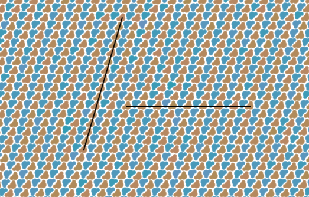

Crystal Defects
===============

We have seen the propagation of stacking defects in the p2gg crystal, changing the crystal structure
to that of the p2 crystal. However, we have not observed any of the other types of defects. This may
be due a lack of crystal growth, although it is also possible that these defects are too
unfavourable.

The particular defect we are most interested in is the line defect, where one of the crystal planes
ends and the surrounding planes curve around it filling the space. The reason for the interest in
this particular defect is that in the p2 crystal there are two different planes where we could
introduce one of these defects. The first is along the stacking of the layers, removing molecules
with the same orientation (along the vertical line in the image below). With the removal of
molecules on this layer, the molecules that will try and fill the space are the incorrect
orientation to fit together, bringing two of the same layers together. Having incompatible layering
is not something found in atomistic crystals which makes the resulting behaviour particularly
interesting.

The other crystal layer we have is orthogonal to the layering of orientations (the horizontal line
in the image above). In this case the issues with the same layers coming together is not present,
with the molecules that could fill the space already being in the appropriate orientation.

Assuming we can construct the defects required in a reasonable manner, having possibly two very
different responses to the same defect will be a really interesting result and something that is
unique to molecular crystals. The only question is creating the defects in a reasonable manner.

Defect Creation
---------------

A method of creating these defects will be to take the crystal structure at a reasonably high
temperature and slowly remove molecules to create the defects within the structure, letting the
crystal relax to the removal at each step. As the number of molecules removed increases the defect
will move from being a point defect to a line defect.

The biggest issue with removing particles is knowing which ones to remove. I could go into the
simulation and manually pick them, although I have no idea what will happen after removing
molecules, so the next one removed might not make sense any longer. An alternate approach which I am
really liking at the moment is to create an interactive bokeh dashboard, which allows for the
querying of molecule ids and the removal of specific molecules. This will allow for a far more
interactive investigation and additionally enable the answering of any questions in a quick
manner. The main issue with this approach is the reproducibility, although If I have the array with
all the molecule ids removed printed to screen then it is possible to copy and paste the list into a
notebook.

Although why do I need a bokeh dashboard, why not just a jupyter notebook? There shouldn't be any
issues creating all the infrastructure required in a notebook. There is jupyterlab support for bokeh
so that is not an issue. Yes it would be a whole lot sleeker as a bokeh server application, although
maybe not as a first attempt.

In creating the defects I will need 
- a function to delete molecules, 
- a function to load and run a snapshot for a specified number of steps
- a function to update the snapshot in the figure
- a figure that allows for the querying of molecular number using the trimer glyph
