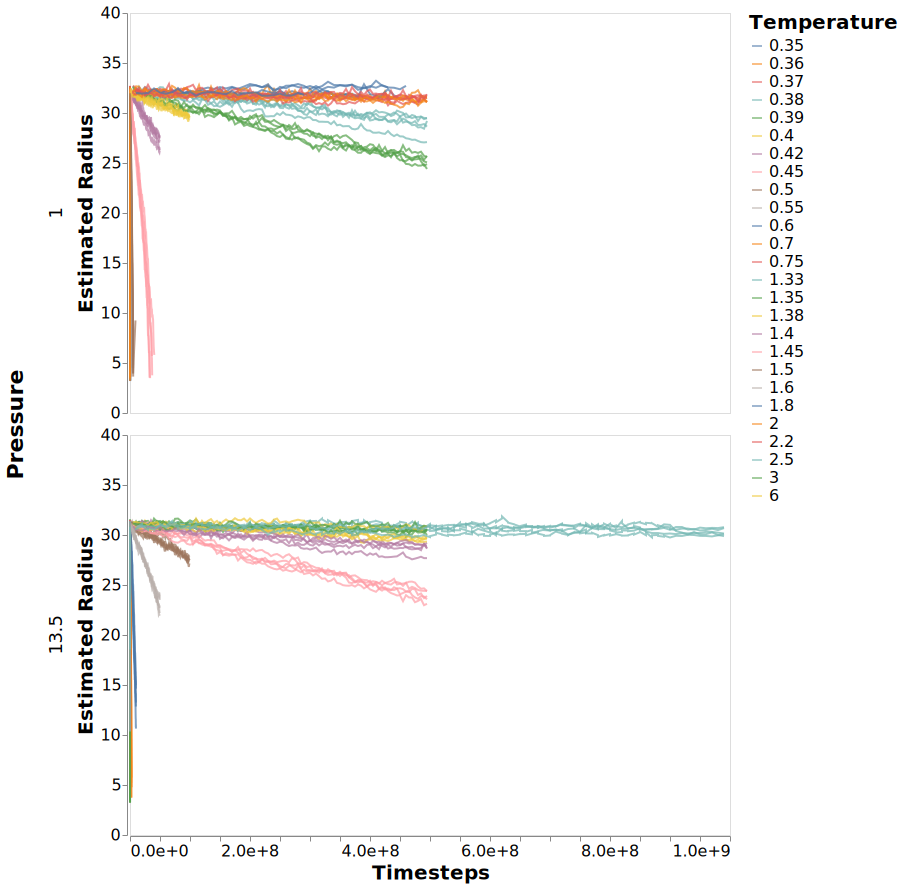

---
jupyter:
  jupytext:
    formats: ipynb,md
    text_representation:
      extension: .md
      format_name: markdown
      format_version: '1.1'
      jupytext_version: 1.2.1
  kernelspec:
    display_name: crystal
    language: python
    name: crystal
---

# Understanding Methods of Computing Melting Rates

I need a method of computing the melting rate of the crystal structures
which will provide a good estimation of both the melting rate and
the error of the melting rate.
Importantly I need an algorithm able to detect the small melting rates at low temperatures.

```python
%load_ext autoreload
%autoreload 2
```

```python
import numpy as np
import pandas
import altair as alt

import sys

sys.path.append("../src")
import figures
```

## Load Data

The data on the melting rates has been pre-calculated and saved to a file.
The data stored is the simulation conditions along with the values
- fraction: The fraction of the simulation cell which is crystalline in nature
- surface_area: The perimeter (the 2D equivalent of surface area) of the crystalline cluster
- volume: The area (2D equivalent of area) of the crystalline cluster
- time: The timestep at which these values apply.

Only the data from the low pressure melting is used in this analysis
since at the time of writing the dataset is better and
it is easier to only deal with a single set of pressures.
I am also limiting the analysis to only the p2 crystal.

```python
# Read file with melting data
with pandas.HDFStore("../data/analysis/rates_rs_clean.h5") as store:
    melting_df = store.get("fractions")
```

## Volume Data

I have plotted the volume of the crystal as a function of time below.
The important point to note is the high levels of noise in the data,
which is a combination the thermal fluctuations and
the inaccuracy of the algorithm I am using for classification.

```python
chart = (
    alt.Chart(melting_df.loc[:, ["time", "temperature", "pressure", "radius"]])
    .mark_point()
    .encode(
        x=alt.X(
            "time:Q",
            title="Timesteps",
            axis=alt.Axis(format="e"),
            scale=alt.Scale(type="linear"),
        ),
        color=alt.Color("temperature:N", title="Temperature"),
        row=alt.Row("pressure:N", title="Pressure"),
        y=alt.Y("radius:Q", title="Estimated Radius"),
    )
)
with alt.data_transformers.enable("default"):
    chart.save("../figures/melting_radius.svg", webdriver="firefox")
```



```python
melting_df[["radius", "pressure", "temperature"]]
```
