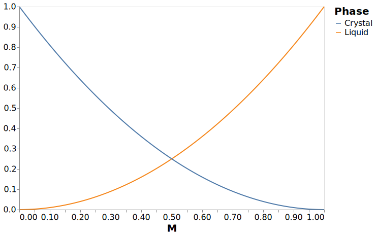
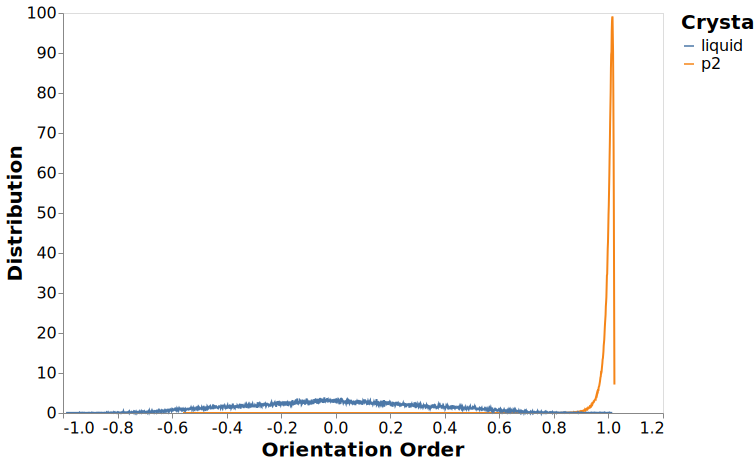
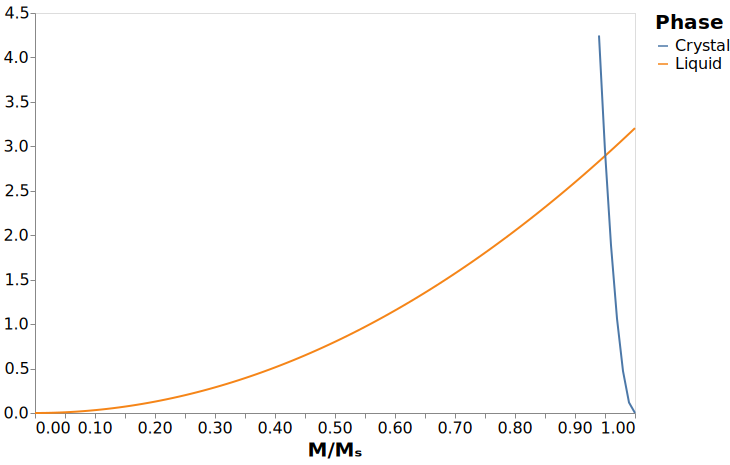
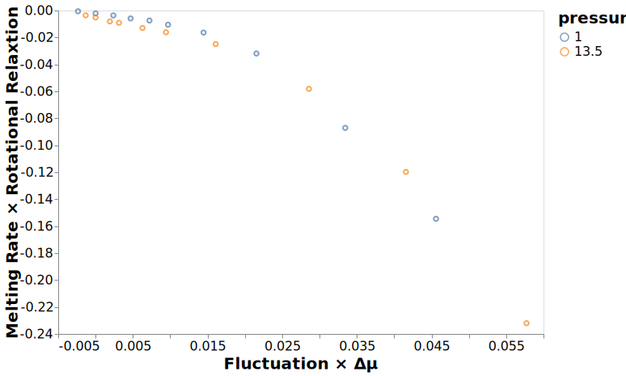
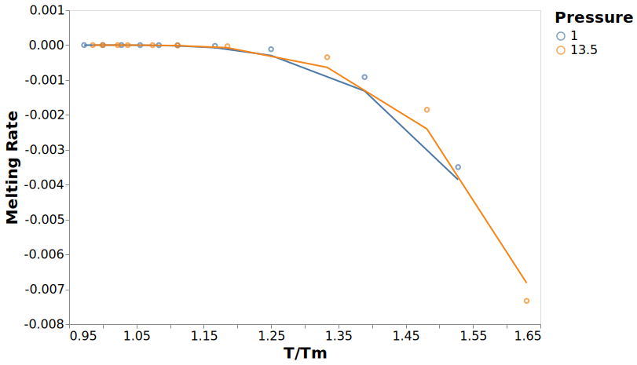
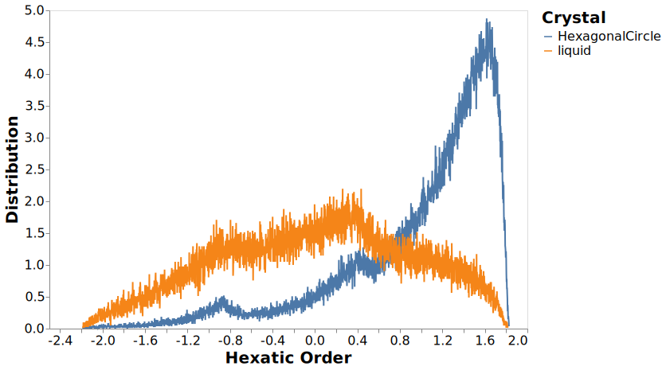
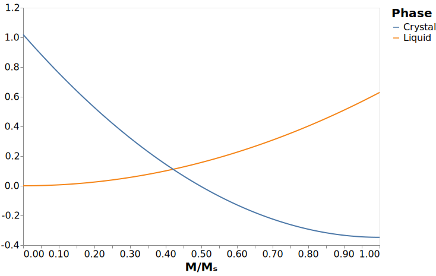

---
jupyter:
  jupytext:
    formats: ipynb,md
    text_representation:
      extension: .md
      format_name: markdown
      format_version: '1.2'
      jupytext_version: 1.5.2
  kernelspec:
    display_name: crystal
    language: python
    name: crystal
---

<!-- #region -->
# Modelling Melting Rates

There are more complicated models of melting.
@Bagdassarian1994 propose a parabolic free energy model
of nucleation and growth.
This model starts by defining a single order parameter
which describes the entire system, $M(\vec{r}, t)$,
with each value of $M(\vec{r}, t)$ representing
the local phase of the material.
The order parameter is defined such that
$M(\vec{r}, t) = 0$ in the bulk liquid, and
$M(\vec{r}, t) = M_c$ a positive constant in the bulk solid.
It should be noted that as described,
this order parameter allows for
no spatial or temporal fluctuations
in either the bulk liquid or solid.
So it has to be a measure which includes
all possible fluctuations at equilibrium,
that is, it either averages over a large space,
at which point it is no longer
"representing the local phase of the material",
or averaging over time,
at which point it is not suitable
for describing time dependent phenomena.


The time evolution for the order parameter $M(\vec{r}, t)$
can be expressed as

$$ \frac{\partial{M(\vec{r}, t)}}{\partial{t}} = -\Gamma \left[
\frac{d{\omega(M)}}{d{M}} - K^2_M \nabla^2 M(\vec{r}, t) \right] $$

where $M = M(\vec{r}, t)$
which was only substituted in half the location
because there weren't enough variables to keep track of already
as demonstrated in the original publication.
Additionally the obfuscation makes the "suggestive" choice of $\omega(M)$
seem like a contribution.

$$ \omega(M) = \min(\frac{\lambda_0}{2}M^2, \frac{\lambda_s}{2}(M-M_s)^2 + \Delta) $$

I have no idea why this was chosen sense, however,
because the original paper describes this as the "suggestive form" for $\omega(M)$
there is *obviously* no need to describe it,
because it is *trivial* to understand why this choice was made.
The parameters $\lambda_0$ and $\lambda_s$ are
the curvature of each parabola,
and $\Delta$ is the free-energy difference
between the liquid and the solid.

The formulation of $\omega(M)$ describes the intersection of two parabolas,
one with a minimum at $M=0$,
and the other with a minumum at $M = M_s$
<!-- #endregion -->

```python
# General packages required for this analysis
import matplotlib.pyplot as plt
import numpy as np
import pandas as pd
import altair as alt
import scipy.optimize
import functools
from functools import partial
from crystal_analysis import figures, util
```

```python
x = np.linspace(0, 1, 101)
omega1 = x ** 2
omega2 = (x - 1) ** 2
df_example = pd.DataFrame({"x": x, "Liquid": omega1, "Crystal": omega2})
```

```python
c = (
    alt.Chart(df_example)
    .transform_fold(["Liquid", "Crystal"])
    .mark_line()
    .encode(
        x=alt.X("x", title="M"),
        y=alt.Y("value:Q", title=""),
        color=alt.Color("key:N", title="Phase"),
    )
)
with alt.data_transformers.enable("default"):
    c.save("../figures/fluctuation_parabola_example.svg", webdriver="firefox")
```




The simplest parabolas describing $\omega(M)$ are depicted above,
with the left hand side of the minimum depicted in the blue line,
while the right hand side of the minimum is depicted by the yellow line.
Here $\lambda_0 = \lambda_s = 1$ and $\Delta = 0$.
The overall value of $\omega(M)$ is found as the minimum
of the two curves.


The intersection of the two parabolas is a point of interest,
which we give the value $M_\text{cusp}$.

Currently these are depicting the state where the curvature $\lambda$ of
the liquid state $\lambda_0$ is the same as the solid state $\lambda_s$,
and the free energy of the liquid is equal to that of the solid.
The difference between the chemical potential energy of each is given by the parameter $\Delta \mu$,
indicating the relative heights of the two parabolas.

The free energy difference between the solid and the liquid
can be approximated as

$$ \Delta \mu \approx \Delta h_m \left( 1 - \frac{T}{T_m} \right) $$

where $\Delta h_m$ is the per-particle enthalpy difference between
the liquid and the solid at the melting point.

The other parameters which are needed,
$\lambda_0$ and $\lambda_s$
can be found from the probability distribution of states.

## Thermodynamics

The first quantity which is to be calculated
is the thermodynamic quantity $\Delta \mu$.
For simplicity,
the rest of this notebook will only be concerned
with quantities at a pressure of 13.50
with the temperature set at the melting point.
The melting point is being read from
the file `../results/melting_points.csv`
as this is the canonical source of the melting point.

```python
pressure = 13.50
df_melt = pd.read_csv("../results/melting_points.csv")
melting_point = df_melt.query("pressure == @pressure")["melting_point"][0]
f"The melting point at a pressure of {pressure} is: {melting_point}"
```

The potential energy of each crystal structure
as been pre-calculated and stored in the file `../results/enthalpy.csv`.
The thermodynamic quantity,
that is the potential energy per particle,
is extracted for the solid, which is the p2 crystal
and for the liquid.

```python
df_pe = pd.read_csv(
    "../results/enthalpy.csv", index_col=["pressure", "temperature", "crystal"]
)
# Extract liquid and solid enthalpies
h_liq = df_pe.loc[(pressure, melting_point, "liquid"), "enthalpy"]
h_solid = df_pe.loc[(pressure, melting_point, "p2"), "enthalpy"]
# Find the difference between them
enthalpy_difference = h_solid - h_liq
f"The potential energy difference at the melting point of {melting_point} is {enthalpy_difference:.4f}"
```

## Probability Distributions

We model the distribution of the orientational ordering
comparing the liquid phase to the crystal phase.
This is finding the value of $O_\theta$,
for all local configurations,
where this is evaluated over the $N$ nearest neighbours

$$ O_\theta = \frac{1}{N} \langle \sum_{i=1}^N \cos^2(\theta_i - \theta_0) \rangle $$

which is 6 in this 2D case.

This data is pre-computed in the file `../data/analysis/fluctuation_rs.h5`,
and for simplicity we are only going to evaluate
this quantity for the pressure of 13.50.
We are comparing these values for the liquid state
which is compared to the p2 crystals as the solid.

```python
file = "../data/analysis/fluctuation_rs.h5"
with pd.HDFStore(file) as src:
    df = src.get("ordering")

# Only handle values with the desired pressure and melting point
df = df.query("pressure==@pressure and temperature == @melting_point")
# This is only valid for the liquid and p2 states
df = df[df["crystal"].isin(["liquid", "p2"])]
# Remove categories for unused crystals
df["crystal"] = df["crystal"].astype("str").astype("category")
```

The distribution of orientational ordering
is displayed in the figure below,
with all temperatures combined into a single line.
This makes it easier to see the overall distribution.

```python
c = (
    alt.Chart(df)
    .mark_line()
    .encode(
        x=alt.X("bins", title="Orientation Order"),
        y=alt.Y("mean(count)", title="Distribution"),
        color=alt.Color("crystal", title="Crystal"),
    )
)
with alt.data_transformers.enable("default"):
    c.save("figures/fluctuation.svg", webdriver="firefox")
```


Most noticeable about this figure
is that unlike the theoretical model,
the 'true' liquid phase is in the middle of the fluctuation,
rather than a one sided distribution.
Additionally it is not centered on zero.
So some rescaling needs to take place.
To make things easy,
the rescaling will be performed such that
the liquid distribution will be centered on 0,
and the solid distribution will be centered on 1.

```python
# Calculate the mean for the liquid and crystal
weighted_means = df.groupby("crystal").apply(
    lambda g: np.average(g["bins"], weights=g["count"])
)
# Normalise the bins to be centered on 0 and 1
df["bins"] = (df["bins"] - weighted_means["liquid"]) / (
    weighted_means["p2"] - weighted_means["liquid"]
)
```

With the values normalised
we get the below figure.
Note that there are values both below 0, and above 1.

```python
c = (
    alt.Chart(df)
    .mark_line()
    .encode(
        x=alt.X("bins", title="Orientation Order"),
        y=alt.Y("mean(count)", title="Distribution"),
        color=alt.Color("crystal", title="Crystal"),
    )
)
with alt.data_transformers.enable("default"):
    c.save("../figures/fluctuation_normalised.svg")
```




With these quantities now having the appropriate range,
the probability distributions will now have the form

$$ P_0(M) = \sqrt{\frac{\lambda_0}{2\pi}} \exp \left[-\frac{\lambda_0}{2} M^2 \right] $$

and

$$ P_s(M) = \sqrt{\frac{\lambda_s}{2\pi}} \exp \left[-\frac{\lambda_s}{2} (M-M_s)^2 \right] $$

which we can fit to the data to get the curvature $\lambda$.

The below code defines a function for the liquid and solid components,
with the liquid having an offset of 0,
while the solid has an offset of 1.

```python
def probability_distribition(x, curvature, offset):
    return np.sqrt(curvature / 2 * np.pi) * np.exp(
        -curvature / 2 * np.square(x - offset)
    )


probability_distribution_liquid = functools.partial(probability_distribition, offset=0)
probability_distribution_solid = functools.partial(probability_distribition, offset=1)
```

These functions can then be used
to find the curvature of each state.

```python
df_liquid = df.query("crystal == 'liquid'")
df_solid = df.query("crystal == 'p2'")

# Find the curvature which best fits the observed points
curvature_liquid = scipy.optimize.curve_fit(
    probability_distribution_liquid, df_liquid["bins"], df_liquid["count"]
)[0][0]
curvature_solid = scipy.optimize.curve_fit(
    probability_distribution_solid, df_solid["bins"], df_solid["count"]
)[0][0]

f"The liquid curvature is {curvature_liquid:.2f}, and the solid curvature is {curvature_solid:.2f}"
```

With the curvature found,
it is now possible to plug these values
back into our definitions for omega,
and also adding the enthalpy difference $\Delta H_m$
which was computed earlier.

```python
omega1 = lambda x: curvature_liquid / 2 * x ** 2
omega2 = lambda x: curvature_solid / 2 * (x - 1) ** 2
```

And plotted,
this gives a very different figure
to what we had initially.
The point at which the two curves cross $M_c$
is now close to 0.9,
and has a significantly larger value
at that crossing point.

```python
df = pd.DataFrame({"Liquid": omega1(x), "Crystal": omega2(x), "x": x}).melt(
    id_vars="x", var_name="Phase"
)

c = (
    alt.Chart(df)
    .mark_line()
    .encode(x=alt.X("x", title="M/Mₛ"), y=alt.Y("value", title=""), color="Phase")
    .transform_filter(alt.datum.value < 5)
)
with alt.data_transformers.enable("default"):
    c.save("../figures/fluctuation_parabola_trimer.svg", webdriver="firefox")
```




The value of $M_c$ can be found using a root finding function

```python
roots = scipy.optimize.fsolve(
    lambda xy: np.array([xy[1] - omega1(xy[0]), xy[1] - omega2(xy[0])]), (0.9, 0.1)
)
f"The value of M_c is {roots[0]}"
```

The intersection of the curves for the liquid and solid
can be considered a potential energy surface,
with particles requiring to move
from the liquid to the solid and vice-versa
by passing through the point of intersection.
So what fraction of particles have a large enough fluctuation
for this transition to occur.
That is, what is the probability of a particle in the liquid
to have a value of $M$ greater than $M_c$.

```python
probability = df_liquid.query("bins > @roots[0]")["probability"].sum()
f"The probability is {probability:.3%}"
```

```python
probability = df_solid.query("bins < @roots[0]")["probability"].sum()
f"The probability is {probability:.3%}"
```

## Melting Rate

Based on the expression for the melting rate

$$ v(T) = -\left[ \frac{2K\Gamma(T)(\sqrt{\lambda_0} + \sqrt{\lambda_s})^2}{M_s^2(\lambda_s\sqrt{\lambda_0} + \lambda_0\sqrt{\lambda_s})}\right] \Delta \mu(T) $$

the melting rate can be calculated

```python
def fluctuation_rate(liquid, crystal):
    return np.square(np.sqrt(liquid) + np.sqrt(crystal)) / (
        crystal * np.sqrt(liquid) + liquid * np.sqrt(crystal)
    )


def fit_constant(
    rate_norm, timescale, curvature_liquid, curvature_solid, enthalpy_diff, temp_norm
):
    def rate_model(
        temp_norm, constant, timescale, curvature_liquid, curvature_solid, enthalpy_diff
    ):
        return (
            -fluctuation_rate(curvature_liquid, curvature_solid)
            * enthalpy_difference
            * (1 - temp_norm)
            * timescale
            * constant
        )

    p0 = (0,)
    model = partial(
        rate_model,
        timescale=timescale,
        curvature_liquid=curvature_liquid,
        curvature_solid=curvature_solid,
        enthalpy_diff=enthalpy_diff,
    )
    const, _ = scipy.optimize.curve_fit(model, temp_norm, rate_norm, p0=p0)
    return const, rate_model


def normalise(df):
    if np.all(df.groupby("crystal").count()["bins"] > 0):
        # Calculate the mean for the liquid and crystal
        weighted_means = df.groupby("crystal").apply(
            lambda g: np.average(g["bins"], weights=g["count"])
        )

        # Normalise the bins to be centered on 0 and 1
        df["bins"] = (df["bins"] - weighted_means["liquid"]) / (
            weighted_means["p2"] - weighted_means["liquid"]
        )
        return df


def find_curvature(label, bins, count):
    if label in ["liquid"]:
        # Find the curvature which best fits the observed points
        return scipy.optimize.curve_fit(probability_distribution_liquid, bins, count)[
            0
        ][0]
    elif label in ["p2", "crystal", "solid"]:
        return scipy.optimize.curve_fit(
            probability_distribution_solid, df_solid["bins"], df_solid["count"]
        )[0][0]
    else:
        raise ValueError("Invalid value for label found:", label)
```


## Fit to Model

Through a refactoring of the above equation

$$ \frac{v(T)}{\Gamma(T) \Delta\mu(T)} = -2K\left[ \frac{(\sqrt{\lambda_0} + \sqrt{\lambda_s})^2}{(\lambda_s\sqrt{\lambda_0} + \lambda_0\sqrt{\lambda_s})}\right]$$

```python
file = "../data/analysis/fluctuation_rs.h5"
with pd.HDFStore(file) as src:
    df_fluctuation = (
        src.get("ordering")
        .query("crystal in ['p2', 'liquid']")
        .assign(crystal=lambda df: df["crystal"].cat.remove_unused_categories())
        .groupby(["temperature", "pressure"])
        .apply(normalise)
        .reset_index(drop=True)
        .groupby(["temperature", "pressure"])
        .apply(
            lambda x: x.groupby("crystal").apply(
                lambda y: find_curvature(y["crystal"].values[0], y["bins"], y["count"])
            )
        )
    )

df_rates = (
    pd.read_hdf("../data/analysis/rates_rs_clean.h5", "rates")
    .groupby(["temperature", "pressure"])["mean"]
    .agg(rate="mean", error="sem")
)

df_dynamics = (
    pd.read_hdf("../data/analysis/dynamics_clean_agg.h5", "relaxations")
    .set_index(["temperature", "pressure"])["rot2_mean"]
    .to_frame("rotational_relaxation")
)

df_fluctuation.columns = ["crystal", "liquid"]
df_all = df_fluctuation.join(df_rates).join(df_dynamics).reset_index().dropna()
df_all["temp_norm"] = util.normalised_temperature(
    df_all["temperature"], df_all["pressure"]
)
```

```python
df_dft = pd.DataFrame(
    {
        "x": fluctuation_rate(df_all["liquid"], df_all["crystal"])
        * (enthalpy_difference * (1 - df_all["temp_norm"])),
        "y": df_all["rate"] * df_all["rotational_relaxation"],
        "pressure": df_all["pressure"],
        "error": df_all["error"],
    }
)
```

```python
chart_dft = (
    alt.Chart(df_dft)
    .mark_point()
    .encode(
        x=alt.X("x", title="Fluctuation × Δμ", scale=alt.Scale(zero=False)),
        y=alt.Y("y", title="Melting Rate × Rotational Relaxtion"),
        yError=alt.YError("error"),
        color=alt.Color("pressure:N", title="Pressure"),
    )
)
with alt.data_transformers.enable("default"):
    chart_dft.save("../figures/melting_dft.svg", webdriver="firefox")
chart_dft
```



```python
const, model = fit_constant(
    df_all["rate"],
    1 / df_all["rotational_relaxation"],
    df_all["liquid"],
    df_all["crystal"],
    enthalpy_difference,
    df_all["temp_norm"],
)
df_all["predict"] = model(
    df_all["temp_norm"],
    const,
    1 / df_all["rotational_relaxation"],
    df_all["liquid"],
    df_all["crystal"],
    enthalpy_difference,
)
```

```python
const
```

```python
c = (
    alt.Chart(df_all)
    .mark_point()
    .encode(
        x=alt.X("temp_norm", title="T/Tm", scale=alt.Scale(zero=False)),
        y=alt.Y("rate", title="Melting Rate"),
        color=alt.Color("pressure:N", title="Pressure"),
    )
)
c = c + c.encode(y="predict").mark_line(interpolate="basis")

with alt.data_transformers.enable("default"):
    c.save("../figures/fluctuation_rate_fit.svg", webdriver="firefox")
    c.transform_filter(alt.datum.temp_norm < 1.2).save(
        "../figures/fluctuation_rate_fit_low.svg", webdriver="firefox"
    )
```



```python
df_h = df_all.set_index(["temperature", "pressure"]).loc[(2.00, 13.50), :]
df_high = pd.DataFrame(
    {
        "Liquid": df_h["liquid"] * x ** 2,
        "Crystal": df_h["crystal"] * (x - 1) ** 2
        + enthalpy_difference * (1 - df_h["temp_norm"]),
        "x": x,
    }
).melt(id_vars="x", var_name="Phase")

c = (
    alt.Chart(df_high)
    .mark_line()
    .encode(x=alt.X("x", title="M/Mₛ"), y=alt.Y("value", title=""), color="Phase")
    .transform_filter(alt.datum.value < 6)
)
c
```

## Comparison with Lennard Jones

For the Lennard-Jones model,
the order parameter being used is the hexatic order parameter

$$ \Psi_6 = |\frac{1}{6} \sum_{k=1}^6 \exp{6 i \theta{k}}| $$

It should be noted that many definitions forgo
the norm || of the complex quantity in the definition,
then fail to mention how the complex quantity in transformed
into a real number.
For the purpose of clarity,
I have included this as part of the definition.

```python
df_disc = pd.read_hdf("../data/analysis/fluctuation_disc.h5", "ordering")
df_disc.loc[df_disc.crystal.isna(), "crystal"] = "liquid"
df_disc = df_disc.query("temperature == 0.53")
df_disc["crystal"] = df_disc["crystal"].cat.remove_unused_categories()
```

```python
alt.Chart(df_disc).mark_line().encode(x="bins", y="count", color="crystal")
```

```python
# Calculate the mean for the liquid and crystal
weighted_means = df_disc.groupby("crystal").apply(
    lambda g: np.average(g["bins"], weights=g["count"])
)
# Normalise the bins to be centered on 0 and 1
df_disc["bins"] = (df_disc["bins"] - weighted_means["liquid"]) / (
    weighted_means["HexagonalCircle"] - weighted_means["liquid"]
)
```

```python
c = (
    alt.Chart(df_disc)
    .mark_line()
    .encode(
        x=alt.X("bins", title="Hexatic Order"),
        y=alt.Y("mean(count)", title="Distribution"),
        color=alt.Color("crystal", title="Crystal"),
    )
)
with alt.data_transformers.enable("default"):
    c.save("../figures/fluctuation_disc_normalised.svg", webdriver="firefox")
```



```python
df_disc_liquid = df_disc.query("crystal == 'liquid'")
df_disc_solid = df_disc.query("crystal == 'HexagonalCircle'")

# Find the curvature which best fits the observed points
curvature_disc_liquid = scipy.optimize.curve_fit(
    probability_distribution_liquid, df_disc_liquid["bins"], df_disc_liquid["count"]
)[0][0]
curvature_disc_solid = scipy.optimize.curve_fit(
    probability_distribution_solid, df_disc_solid["bins"], df_disc_solid["count"]
)[0][0]

f"The liquid curvature is {curvature_disc_liquid:.2f}, and the solid curvature is {curvature_disc_solid:.2f}"
```

```python
df_disc_thermo_crys = pd.read_table(
    "../data/simulations/disc_crystal/output/thermo-Disc-P1.00-T0.53-HexagonalCircle.log"
)
df_disc_thermo_crys["enthalpy"] = (
    df_disc_thermo_crys["potential_energy"]
    + df_disc_thermo_crys["kinetic_energy"]
    + df_disc_thermo_crys["pressure"]
    + df_disc_thermo_crys["volume"]
) / df_disc_thermo_crys["N"]
df_disc_thermo_liq = pd.read_table(
    "../data/simulations/disc_liquid/output/thermo-Disc-P1.00-T0.53.log"
)
df_disc_thermo_liq["enthalpy"] = (
    df_disc_thermo_liq["potential_energy"]
    + df_disc_thermo_liq["kinetic_energy"]
    + df_disc_thermo_liq["pressure"]
    + df_disc_thermo_liq["volume"]
) / df_disc_thermo_liq["N"]

enthalpy_disc = (
    df_disc_thermo_crys["enthalpy"].mean() - df_disc_thermo_liq["enthalpy"].mean()
)
```

```python
omega1_disc = lambda x: curvature_disc_liquid / 2 * x ** 2
omega2_disc = lambda x: curvature_disc_solid / 2 * (x - 1) ** 2 + enthalpy_disc
```

```python
df = pd.DataFrame({"Liquid": omega1_disc(x), "Crystal": omega2_disc(x), "x": x}).melt(
    id_vars="x", var_name="Phase"
)

c = (
    alt.Chart(df)
    .mark_line()
    .encode(x=alt.X("x", title="M/Mₛ"), y=alt.Y("value", title=""), color="Phase")
    .transform_filter(alt.datum.value < 5)
)
with alt.data_transformers.enable("default"):
    c.save("../figures/fluctuation_parabola_disc.svg", webdriver="firefox")
```



```python
roots_disc = scipy.optimize.fsolve(
    lambda xy: np.array([xy[1] - omega1_disc(xy[0]), xy[1] - omega2_disc(xy[0])]),
    (0.9, 0.1),
)
f"The value of M_c is {roots_disc[0]}"
```

```python
probability_disc = df_disc_liquid.query("bins > @roots_disc[0]")["probability"].sum()
f"The probability is {probability_disc:.3%}"
```

```python
probability_disc = df_disc_solid.query("bins < @roots_disc[0]")["probability"].sum()
f"The probability is {probability_disc:.3%}"
```

```python
rate_disc = (
    np.square(np.sqrt(curvature_disc_liquid) + np.sqrt(curvature_disc_solid))
    / (
        curvature_disc_solid * np.sqrt(curvature_disc_liquid)
        + curvature_disc_liquid * np.sqrt(curvature_disc_solid)
    )
    * enthalpy_difference
)
f"The rate is {rate_disc}"
```
