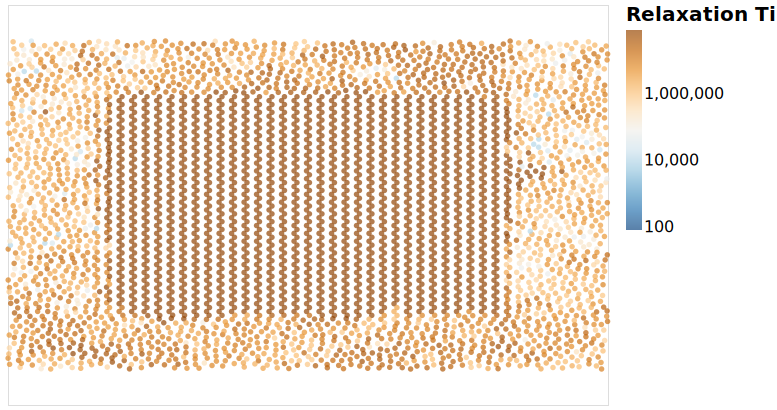
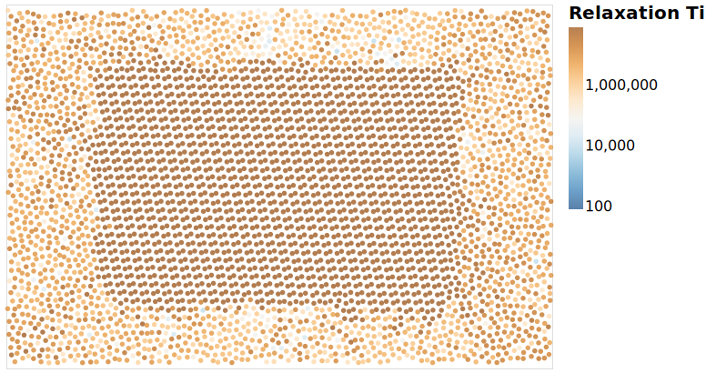

---
jupyter:
  jupytext:
    formats: ipynb,md
    text_representation:
      extension: .md
      format_name: markdown
      format_version: '1.2'
      jupytext_version: 1.3.3
  kernelspec:
    display_name: crystal
    language: python
    name: crystal
---

# Spatial Dynamics

We expect that at the interface of the crystal
there is a prevention of the rotational motion.
In some cases, notably the pg crystal
there is possibly a change in relaxation times
depending on the crystal face.

```python
import numpy as np
import pandas as pd
from sdanalysis import open_trajectory, dynamics
from pathlib import Path
import altair as alt
import gsd.hoomd
from sdanalysis import HoomdFrame

from sdanalysis.figures import plot_frame, show, output_notebook
from crystal_analysis import figures

output_notebook()
```

## Dataset

The data used in this analysis is the `interface` dataset.
I want to be able to develop this idea
for each of the different crystals.

```python
directory = Path("../data/simulations/interface/output")
file_pg = directory / "dump-Trimer-P1.00-T0.35-pg.gsd"
file_p2 = directory / "dump-Trimer-P1.00-T0.35-p2.gsd"
outfile = Path("spatial_analysis.h5")
```

## Analysis

The interface dataset doesn't have the dynamics results pre-calculated
so this needs to be performed.
The dynamics are calculated using the tool from sdanalysis.

```python
try:
    df_dyn_pg = pd.read_hdf(outfile, "pg")
except FileNotFound:
    dyn_pg = None
    for frame in open_trajectory(file_pg, progressbar="notebook"):
        if dyn_pg is None:
            dyn_pg = dynamics.Relaxations.from_frame(frame, wave_number=2.9)
        dyn_pg.add_frame(frame)
    df_dyn_pg = pd.DataFrame(
        {key: item.get_status() for key, item in dyn_pg.mol_relax.items()}
    )
    df_dyn_pg.to_hdf(outfile, "pg")
```

## Visualisation

This should visualise the relaxation times
and the crystal.

```python
frame_pg = HoomdFrame(gsd.hoomd.open(file_pg)[0])
pg_crystal = (np.abs(frame_pg.x_position) < frame_pg.box[0] / 3) & (
    np.abs(frame_pg.y_position) < frame_pg.box[1] / 3
)
```

```python
df_pg = pd.DataFrame(
    {
        "x": frame_pg.x_position,
        "y": frame_pg.y_position,
        "rot_relax": df_dyn_pg["tau_T2"],
        "crystalline": pg_crystal,
    }
)
df_pg.loc[df_pg["rot_relax"] > 1e8, "rot_relax"] = 1e8
```

```python
df_relax = pd.read_hdf(
    "../data/analysis/dynamics_clean_agg.h5", "molecular_relaxations"
).set_index(["pressure", "temperature"])
relax_liq = df_relax.loc[(1.00, 0.35), "tau_T2_mean"]
```

```python
length = 100
c_pg = (
    alt.Chart(df_pg)
    .mark_point(filled=True)
    .encode(
        x=alt.X(
            "x",
            title="",
            scale=alt.Scale(domain=(-length * 4 / 6, length * 4 / 6)),
            axis=None,
        ),
        y=alt.Y("y", title="", scale=alt.Scale(domain=(-length, length)), axis=None),
        # When updated version of altair is released (4.2) use domainMid=relax_liq
        color=alt.Color(
            "rot_relax",
            title="Relaxation Time",
            scale=alt.Scale(
                type="log",
                domain=[
                    10 ** (np.log10(relax_liq) - 3),
                    10 ** (np.log10(relax_liq) + 3),
                ],
                scheme=alt.Diverging("blueorange"),
            ),
        ),
    )
)
with alt.data_transformers.enable("default"):
    c_pg.save("../figures/spatial_relaxation_pg.svg", webdriver="firefox")
```




## Repeat with p2 dataset

```python
try:
    df_dyn_p2 = pd.read_hdf(outfile, "p2")
except (FileNotFound, KeyError):
    dyn_p2 = None
    for frame in open_trajectory(file_p2, progressbar="notebook"):
        if dyn_p2 is None:
            dyn_p2 = dynamics.Relaxations.from_frame(frame, wave_number=2.9)
        dyn_p2.add_frame(frame)
    df_dyn_p2 = pd.DataFrame(
        {key: item.get_status() for key, item in dyn_p2.mol_relax.items()}
    )
    df_dyn_p2.to_hdf(outfile, "pg")
```

```python
frame_p2 = HoomdFrame(gsd.hoomd.open(file_p2)[-1])
```

```python
crystal_p2 = (np.abs(frame_p2.x_position) < frame_p2.box[0] / 3) & (
    np.abs(frame_p2.y_position) < frame_p2.box[1] / 3
)
```

```python
df_p2 = pd.DataFrame(
    {
        "x": frame_p2.x_position,
        "y": frame_p2.y_position,
        "rot_relax": df_dyn_p2["tau_T2"],
        "crystalline": crystal_p2,
    }
)
df_p2.loc[df_p2["rot_relax"] > 1e8, "rot_relax"] = 1e8
```

```python
relax_liq = df_relax.loc[(1.00, 0.35), "tau_T2_mean"]
```

```python
length = 90
c_p2 = (
    alt.Chart(df_p2)
    .mark_point(filled=True)
    .encode(
        x=alt.X("x", title="", scale=alt.Scale(domain=(-length, length)), axis=None),
        y=alt.Y(
            "y",
            title="",
            scale=alt.Scale(domain=(-length * 4 / 6, length * 4 / 6)),
            axis=None,
        ),
        # When updated version of altair is released (4.2) use domainMid=relax_liq
        color=alt.Color(
            "rot_relax",
            title="Relaxation Time",
            scale=alt.Scale(
                type="log",
                domain=[
                    10 ** (np.log10(relax_liq) - 3),
                    10 ** (np.log10(relax_liq) + 3),
                ],
                scheme=alt.Diverging("blueorange"),
            ),
        ),
    )
)
with alt.data_transformers.enable("default"):
    c_p2.save("../figures/spatial_relaxation_p2.svg", webdriver="firefox")
```


